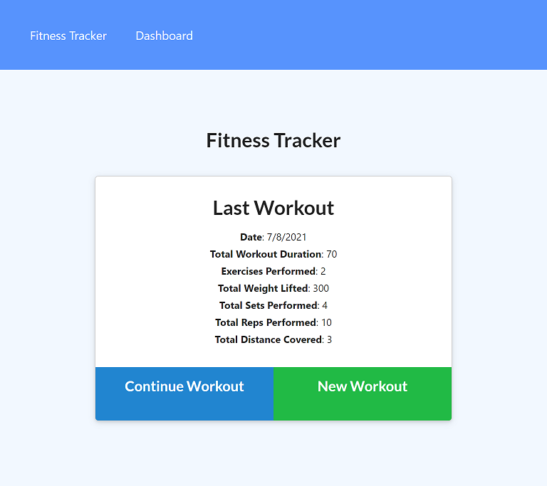
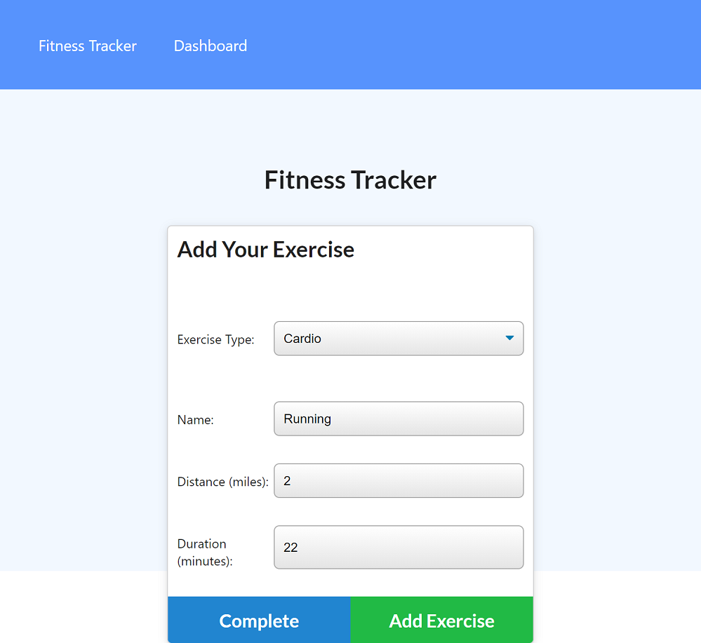
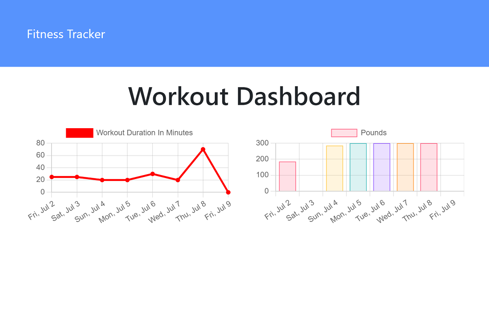

# Workout Tracker
A Heroku hosted application using AtlasDB to track workout data.  The user can create workouts and add cardio or resistance exercises to the workout.  A dashboard view is included which shows workout data from the last seven days in chart form.

## Deployment

[Deployment Link](https://jbyrd-workout-tracker.herokuapp.com/)

## Screenshots

## Author

Justin Byrd [email](mailto:justin_byrd@hotmail.com)
